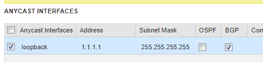
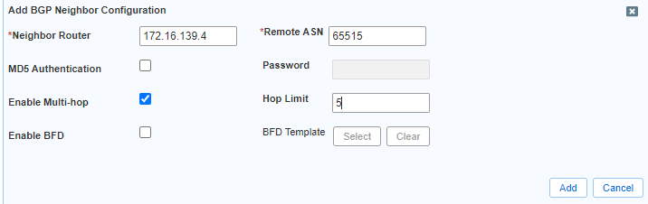

Infoblox Anycast with Azure Route Server
==============


# Why would you want to do this?-

- Anycast is used widely in the DNS Infrastructure that underpins the public Internet, as it offers optimised failover times and performance against that of regular DNS TTL failback mechanisms
- Allows On-Premises locations to forward to a single IP address that represents "Azure", this is both simple, and allows the network, based on BGP AS-Path-length, to route the packet most optimally
- Optimise [some Multi-region Private Link DNS integration designs](https://github.com/adstuart/azure-privatelink-multiregion#621-mitigation-options) with On-Premises Infoblox

For wider context on the use of Azure Route Server with Anycast, please see the associated higher level whitepaper @ https://github.com/adstuart/azure-routeserver-anycast

## Warning!

This design presents the use of Infoblox Anycast integration for accessing the common Anycast loopback IP address from **On-Premises only**. Do not assume that the same loopback can be accessed from any region in Azure. There are platform controls to prevent certain flows with ARS and ExpressRoute interactions. Please see caveat @ https://github.com/adstuart/azure-anycast-interregion

## Thanks!

This lab/testing borrows heavily from Daniel Mauser's repo @ https://github.com/dmauser/Lab/tree/master/RS-AA-OPNsense-ForceTunnel-ER

# Configuration

## Single Region scenario (West Europe)

### Define variables

```
rg=lab-ars-we #replace with desired resource group name
location=westeurope #set azure region
hubname="Hub"
hubvnetcidr="172.16.136.0/22"
hubexternalcidr="172.16.136.0/26"
hubinternalcidr="172.16.136.64/26"
hubprotectedcidr="172.16.136.128/26"
hubGatewaySubnet="172.16.138.0/27"
hubRouteServerSubnet="172.16.139.0/27"
spoke1name="SpokeA"
spoke1cird="10.137.0.0/16"
spoke1vmsubnet="10.137.0.0/24"
ercircuit="Intercloud-London" # Replace with your ER Circuit Name
errg="GBB-ER-LAB-NE" # set ER Circuit Resource Group
erauthorizationkey="" #set ER Authorization Key (Optional)
nva1=infoblox-nva1
nva2=infoblox-nva2
mypip=$(curl ifconfig.io -s) # or replace with your home public ip, example mypip="x.x.x.x" (required for Cloud Shell deployments where API calls are not coming from your home IP)
```

### Create VNets and subnets

```
#Build Networks Hub and Spoke Networks
# HUB VNET
az group create --name $rg --location $location --output none
az network vnet create --resource-group $rg --name $hubname-vnet --location $location --address-prefixes $hubvnetcidr --subnet-name external --subnet-prefix $hubexternalcidr --output none
az network vnet subnet create --address-prefix $hubinternalcidr --name internal --resource-group $rg --vnet-name $hubname-vnet --output none
az network vnet subnet create --address-prefix $hubprotectedcidr --name protected --resource-group $rg --vnet-name $hubname-vnet --output none
az network vnet subnet create --address-prefix $hubGatewaySubnet --name GatewaySubnet --resource-group $rg --vnet-name $hubname-vnet --output none
az network vnet subnet create --address-prefix $hubRouteServerSubnet --name RouteServerSubnet --resource-group $rg --vnet-name $hubname-vnet --output none
#Spoke1 VNET
az network vnet create --resource-group $rg --name $spoke1name-vnet --location $location --address-prefixes $spoke1cird --subnet-name vmsubnet --subnet-prefix $spoke1vmsubnet --output none
```

### Create VNET Peerings between HUB and Spokes

```
# Hub to Spoke1
az network vnet peering create -g $rg -n $hubname-to-$spoke1name --vnet-name $hubname-vnet --allow-vnet-access --allow-forwarded-traffic --remote-vnet $(az network vnet show -g $rg -n $spoke1name-vnet --query id --out tsv) --output none --allow-gateway-transit
az network vnet peering create -g $rg -n $spoke1name-to-$hubname --vnet-name $spoke1name-vnet --allow-vnet-access --allow-forwarded-traffic --remote-vnet $(az network vnet show -g $rg -n $hubname-vnet  --query id --out tsv) --output none --use-remote-gateways
```

### Create ER Gateway

```
az network public-ip create --name $hubname-ergw-pip --resource-group $rg --location $location
az network vnet-gateway create --name $hubname-ergw --resource-group $rg --location $location --public-ip-address $hubname-ergw-pip --vnet $hubname-vnet --gateway-type "ExpressRoute" --sku "Standard" --no-wait
```

### Create ER Circuit

This guide assumes you have a provisioned ER circuit to work with.

### Deploy test VM in spoke

```
echo "Type username and password to be used when deploying VMS"
read -p 'Username: ' username && read -sp 'Password: ' password #set variables for username and password over prompt. Echo $password to ensure you type password correctly.
az network public-ip create --name $spoke1name-vm-pip --resource-group $rg --location $location --allocation-method Dynamic
az network nic create --resource-group $rg -n $spoke1name-vm-nic --location $location --subnet vmsubnet --vnet-name $spoke1name-vnet --public-ip-address $spoke1name-vm-pip 
az vm create -n $spoke1name-vm -g $rg --image UbuntuLTS --size Standard_B1s --admin-username $username --admin-password $password --nics $spoke1name-vm-nic --no-wait --location $location
```

### Deploy and configure  Infoblox appliance in Hub

> :warning: Infoblox Azure Marketplace images come with a 90 day trial license

- Follow the guide here to deploy Azure VM appliance in your Hub VNet: https://www.infoblox.com/wp-content/uploads/infoblox-deployment-guide-infoblox-vnios-for-microsoft-azure.pdf
  - NB. Your Infoblox deployment needs its own empty RG, however it can use the VNets and resources your provisioned above for VNet, subnet etc
- For this lab I used Infoblox NIOS 8.6.0 for DDI. Model TE-v1425.
- Finish initial setup of Grid Manager via UI
- Follow the same above guide to enable DNS (with recurision), NTP and setup an initial test dns forward lookup zone
  - My test authortitative zone is called "testzone.com" with one A record ```test.testzone.com > 192.168.100.1```

### Deploy Azure Route Server and connect to Infoblox

Wait for ER Gatway provisioning before proceeding.

```
az network public-ip create --name rs-pip --resource-group $rg --location $location --sku standard
az network routeserver create --resource-group $rg --name $hubname-rs \
--hosted-subnet $(az network vnet subnet show --resource-group $rg --vnet-name $hubname-vnet --name RouteServerSubnet --query id --out tsv) --public-ip-address rs-pip
az network routeserver peering create --resource-group $rg --routeserver $hubname-rs --name $nva1 --peer-asn 65002 \
--peer-ip 172.16.136.4 #your infoblox LAN1 interface
```

### Connect Infoblox to ARS and enable Anycast

- Enable Anycast with Grid Manager > Member Edit > Anycast


- Enable Infoblox NVA to peer with Azure Route server.

```
adam@Azure:~$ az network routeserver list --resource-group $rg --query '{IPs:[].virtualRouterIps}'
{
  "IPs": [
    [
      "172.16.139.4",
      "172.16.139.5"
    ]
  ]
}
```

 
 

- Add Anycast loopback as additional DNS listener.


<images>

### Test Infoblox Anycast

Check your Anycast address (1.1.1.1) is being received by ARS from the Infoblox NVA.

```
adam@Azure:~$ az network routeserver peering list --routeserver $hubname-rs -g $rg -o table #check peer status
Name           PeerAsn    PeerIp        ProvisioningState    ResourceGroup
-------------  ---------  ------------  -------------------  ---------------
infoblox-nva1  65002      172.16.136.4  Succeeded            lab-ars-we

adam@Azure:~$ az network routeserver peering list-learned-routes -n $nva1    --routeserver $hubname-rs -g $rg
{
  "RouteServiceRole_IN_0": [
    {
      "asPath": "65002",
      "localAddress": "172.16.139.4",
      "network": "1.1.1.1/32",
      "nextHop": "172.16.136.4",
      "origin": "EBgp",
      "sourcePeer": "172.16.136.4",
      "weight": 32768
    }
  ],
  "RouteServiceRole_IN_1": [
    {
      "asPath": "65002",
      "localAddress": "172.16.139.5",
      "network": "1.1.1.1/32",
      "nextHop": "172.16.136.4",
      "origin": "EBgp",
      "sourcePeer": "172.16.136.4",
      "weight": 32768
    }
  ],
  "value": null
  ```

Check your Spoke Test VM is recieving the Anycast address (1.1.1.1) from Azure Route Server.

```
adam@Azure:~$ az network nic show-effective-route-table --resource-group  $rg --name $spoke1name-vm-nic -o table
Source                 State    Address Prefix    Next Hop Type          Next Hop IP
---------------------  -------  ----------------  ---------------------  -------------
Default                Active   10.137.0.0/16     VnetLocal
Default                Active   172.16.136.0/22   VNetPeering
VirtualNetworkGateway  Active   1.1.1.1/32        VirtualNetworkGateway  172.16.136.4
```

Set your Spoke VNet DNS to utilise the Anycast IP

```
az network vnet update -g $rg -n $spoke1name-vnet --dns-servers 1.1.1.1
```

Reboot your Spoke VM, login and test DNS resolution 

```
gbb_admin@SpokeA-vm:~$ nslookup test.testzone.com
Server:         127.0.0.53
Address:        127.0.0.53#53

Non-authoritative answer:
Name:   test.testzone.com
Address: 192.168.100.1
```

:checkered_flag: Single region Anycast-based custom DNS configuraiton complete

- Your Azure Virtual Machine is now sending it's requests for DNS resolution to 1.1.1.1 as per the VNet level custom DNS servers. 
- In turn, due to Azure Route Server, the VM knows that packets destined to 1.1.1.1 should be send to your Infoblox NVA. 
- Finally, Infoblox is configured to listen on 1.1.1.1, and returns the A record specified in the locally configured zone.

## Hybrid Scenario (West Europe and On-Premises)

### Connect ER Gateway to ER circuit

```
erid=$(az network express-route show -n $ercircuit -g $errg --query id -o tsv) 
az network vpn-connection create --name Connection-to-$ercircuit \
--resource-group $rg --vnet-gateway1 $hubname-ergw \
--express-route-circuit2 $erid \
--routing-weight 0
```

### Enable Branch-to-branch on ARS

```
az network routeserver update --resource-group $rg --name $hubname-rs --allow-b2b-traffic true
```

### Verify

Checkout this excellent article from Jose Moreno for more ExpressRoute CLI detail https://blog.cloudtrooper.net/2021/07/12/cli-based-analysis-of-an-expressroute-private-peering/.

Check that your ExpressRoute Gateway is receiving the 1.1.1.1 prefix from ARS.

```
adam@Azure:~$ az network vnet-gateway list-learned-routes -n $hubname-ergw -g $rg -o table | grep 65002
1.1.1.1/32        IBgp      172.16.139.4   65002                          32768     172.16.136.4
1.1.1.1/32        IBgp      172.16.139.5   65002                          32768     172.16.136.4
```

Check that your ExpressRoute circuit is receiving 1.1.1.1 from your ExpressRoute Gateway

```
adam@Azure:~$ az network express-route list-route-tables -g $errg -n $ercircuit --path primary --peering-name AzurePrivatePeering --query value -o table | grep 1.1.1.1
WARNING: This command is in preview and under development. Reference and support levels: https://aka.ms/CLI_refstatus
1.1.1.1/32       172.16.138.12               0         65515 65002
1.1.1.1/32       172.16.138.13*              0         65515 65002
```

Login to On-Premises VM and test DNS resolution.
> NB. In this test I am manually specifying 1.1.1.1 as my DNS lookup server. In a typical Infoblox deployment, the On-Premises environment would already be configured to utilise 1.1.1.1, and this would be served by the local Grid members. This test therefore highlights that if these local Grid members were to become degraded or offline, DNS requests would automatically get routed over ExpressRoute via the BGP 1.1.1.1 Anycast advertisement, once the local LAN route advertisements time out.

```
# Verify local machine, 192.168.2.1 = my On-Premises test VM
C:\Users\Administrator>ipconfig /all | findstr IPv4
   IPv4 Address. . . . . . . . . . . : 192.168.2.1(Preferred)

# Show latency from On-Premises to Azure (Paris to London to West Europe)
C:\Users\Administrator>ping 1.1.1.1
Pinging 1.1.1.1 with 32 bytes of data:
Reply from 1.1.1.1: bytes=32 time=18ms TTL=59

# Test resolution of Infoblox hosted forward lookup zone
C:\Users\Administrator>nslookup test.testzone.com 1.1.1.1
Server:  one.one.one.one
Address:  1.1.1.1

Name:    test.testzone.com
Address:  192.168.100.1
```


## Multi Region Scenario (West Europe and North Europe)

Repeat deployment for second region. With minor differences this time:

- ER circuit connected to gateway prior to deploying Infoblox (to enable reachability between North Europe and West Europe hubs for Infoblox sync)
- Infoblox NVA deployed as GRID member (as part of GRID initially setup in West Europe)

```
### Create Variables

rg=lab-ars-ne #replace with desired resource group name
location=northeurope #set azure region
hubname="Hub"
hubvnetcidr="172.16.156.0/22"
hubexternalcidr="172.16.156.0/26"
hubinternalcidr="172.16.156.64/26"
hubprotectedcidr="172.16.156.128/26"
hubGatewaySubnet="172.16.158.0/27"
hubRouteServerSubnet="172.16.159.0/27"
spoke1name="SpokeA"
spoke1cird="10.237.0.0/16"
spoke1vmsubnet="10.237.0.0/24"
ercircuit="Intercloud-London" # Replace with your ER Circuit Name
errg="GBB-ER-LAB-NE" # set ER Circuit Resource Group
erauthorizationkey="" #set ER Authorization Key (Optional)
nva1=infoblox-nva1
nva2=infoblox-nva2
mypip=$(curl ifconfig.io -s) # or replace with your home public ip, example mypip="x.x.x.x" (required for Cloud Shell deployments where API calls are not coming from your home IP)

### Create VNets and subnets

#Build Networks Hub and Spoke Networks
# HUB VNET
az group create --name $rg --location $location --output none
az network vnet create --resource-group $rg --name $hubname-vnet --location $location --address-prefixes $hubvnetcidr --subnet-name external --subnet-prefix $hubexternalcidr --output none
az network vnet subnet create --address-prefix $hubinternalcidr --name internal --resource-group $rg --vnet-name $hubname-vnet --output none
az network vnet subnet create --address-prefix $hubprotectedcidr --name protected --resource-group $rg --vnet-name $hubname-vnet --output none
az network vnet subnet create --address-prefix $hubGatewaySubnet --name GatewaySubnet --resource-group $rg --vnet-name $hubname-vnet --output none
az network vnet subnet create --address-prefix $hubRouteServerSubnet --name RouteServerSubnet --resource-group $rg --vnet-name $hubname-vnet --output none
#Spoke1 VNET
az network vnet create --resource-group $rg --name $spoke1name-vnet --location $location --address-prefixes $spoke1cird --subnet-name vmsubnet --subnet-prefix $spoke1vmsubnet --output none

### Create VNET Peerings between HUB and Spokes

# Hub to Spoke1
az network vnet peering create -g $rg -n $hubname-to-$spoke1name --vnet-name $hubname-vnet --allow-vnet-access --allow-forwarded-traffic --remote-vnet $(az network vnet show -g $rg -n $spoke1name-vnet --query id --out tsv) --output none --allow-gateway-transit
az network vnet peering create -g $rg -n $spoke1name-to-$hubname --vnet-name $spoke1name-vnet --allow-vnet-access --allow-forwarded-traffic --remote-vnet $(az network vnet show -g $rg -n $hubname-vnet  --query id --out tsv) --output none --use-remote-gateway

### Create ER Gateway

az network public-ip create --name $hubname-ergw-pip --resource-group $rg --location $location
az network vnet-gateway create --name $hubname-ergw --resource-group $rg --location $location --public-ip-address $hubname-ergw-pip --vnet $hubname-vnet --gateway-type "ExpressRoute" --sku "Standard" --no-wait

### Create ER Circuit

This guide assumes you have a provisioned ER circuit to work with.

### Deploy test VM in spoke

echo "Type username and password to be used when deploying VMS"
read -p 'Username: ' username && read -sp 'Password: ' password #set variables for username and password over prompt. Echo $password to ensure you type password correctly.
az network public-ip create --name $spoke1name-vm-pip --resource-group $rg --location $location --allocation-method Dynamic
az network nic create --resource-group $rg -n $spoke1name-vm-nic --location $location --subnet vmsubnet --vnet-name $spoke1name-vnet --public-ip-address $spoke1name-vm-pip 
az vm create -n $spoke1name-vm -g $rg --image UbuntuLTS --size Standard_B1s --admin-username $username --admin-password $password --nics $spoke1name-vm-nic --no-wait --location $location

### Connect ER Gateway to ER circuit

Wait for ER Gateway provisioning before proceeding.

erid=$(az network express-route show -n $ercircuit -g $errg --query id -o tsv) 
az network vpn-connection create --name Connection-to-$ercircuit \
--resource-group $rg --vnet-gateway1 $hubname-ergw \
--express-route-circuit2 $erid \
--routing-weight 0
```

### Deploy and configure Infoblox appliance in second region (West Europe) Hub

- Follow the guide here to deploy Azure VM appliance in your Hub VNet: https://www.infoblox.com/wp-content/uploads/infoblox-deployment-guide-infoblox-vnios-for-microsoft-azure.pdf
  - Bonus CLI guide for adding node to GRID master https://docs.infoblox.com/display/nutanix/Joining+NIOS+Virtual+Appliances+to+the+Grid
- For this lab I used Infoblox NIOS 8.6.0 for DDI. Model TE-v1425.
- Once you have deployed the VM image, and before opening the Infoblox GUI, go back to your GRID master in region A (West Europe) and pre-provision the grid member, you will need to specify it using private IP
- Finish initial setup of West Europe Infoblox via UI - **Join existing GRID rather than configuring NVA as GRID master.**
- If you have completed this step successful, it should look as follow from the GRID master UI:

- Finish setting up from Grid master, enable DNS and NTP on the secondary node
- In my testing I had to enable my secondary grid server within the testzone.com config, along with grid replication.


- Repeat Anycast/BGP process on Infoblox UI to peer with Azure Route Server in Region 2 (I used AS 65003 for region 2 Infoblox, and 65002 for region 1 Infoblox to aid in troubleshooting)

```
### Deploy ARS, connect to Infoblox
az network public-ip create --name rs-pip --resource-group $rg --location $location --sku standard
az network routeserver create --resource-group $rg --name $hubname-rs \
--hosted-subnet $(az network vnet subnet show --resource-group $rg --vnet-name $hubname-vnet --name RouteServerSubnet --query id --out tsv) --public-ip-address rs-pip
az network routeserver peering create --resource-group $rg --routeserver $hubname-rs --name $nva1 --peer-asn 65003 \
--peer-ip 172.16.156.68 #your infoblox LAN1 interface
az network routeserver update --resource-group $rg --name $hubname-rs --allow-b2b-traffic true

### Check ER GW is getting Anycast 1.1.1.1 from ARS (from Infoblox)
adam@Azure:~$ az network vnet-gateway list-learned-routes -n $hubname-ergw -g $rg -o table | grep 65003
1.1.1.1/32        IBgp      172.16.159.4   65003                          32768     172.16.156.68
1.1.1.1/32        IBgp      172.16.159.5   65003                          32768     172.16.156.68
```

Here we can see that our ER circuit is learning the 1.1.1.1/32 anycast route from both regions.


# A note on AS-path prepend-

:warning: It does not appear that you are able to set as-path-prepend outbound from the Infoblox appliance, therefore you ability to control, deterministically, wich region serves the Anycast request will not be possible today.

